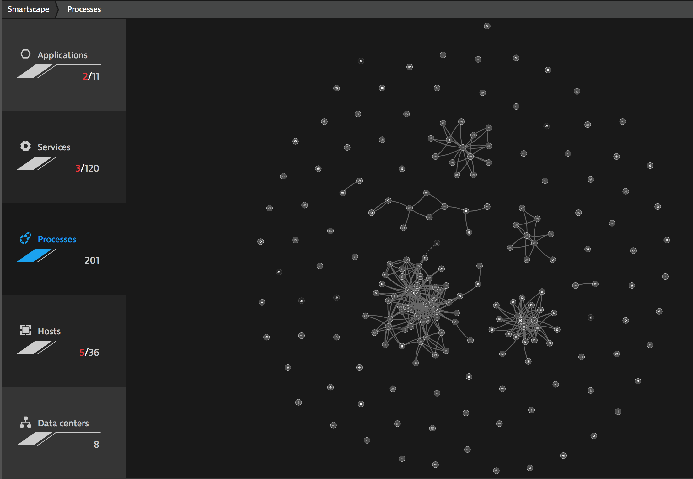
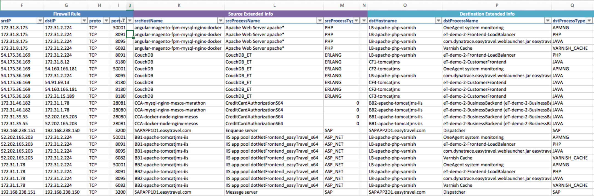

## Overview
This example demonstrates the use of Topology endpoints and small amounts of code to create familiar documents, such as an Excel spreadsheet.  The intent in the example was to quickly build a list of possible firewall rules from Dynatrace detected process to process connections.

### From this

### To this

## Areas for follow-up
- Somehow show multiple IPs & ports better in the spreadsheet
- Incorporate Application & Service data as well
- Explore real-world possible uses
