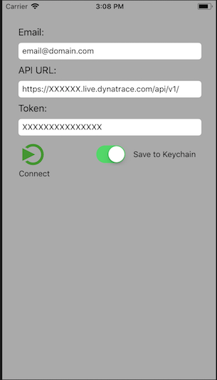
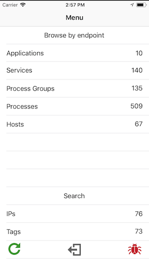
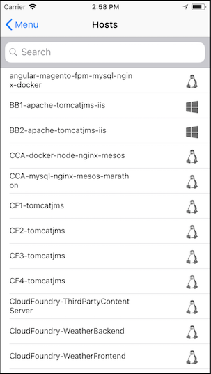
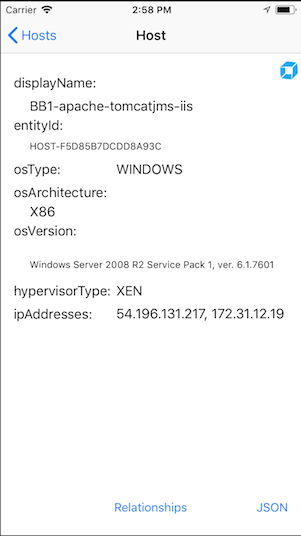
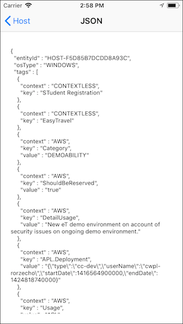
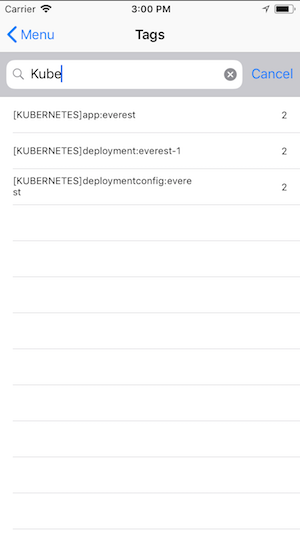
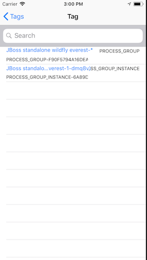

# dtPocketTopology

A mobile app demonstrating the Dynatrace REST API topology endpoint.  It provides a rough text-based approximation of data available in Dynatrace's SmartScape Topology.  Theoretical usecases include: a datacenter tech wanting to know information about a server in the datacenter, an operations manager remote during an outage needing basic "what connects to what" info, an enterprise architect needing a quick reference for their environment while travelling.

### Screenshots











## Getting Started

These instructions will get you a copy of the project up and running on your local machine for development and testing purposes. See deployment for notes on how to deploy the project on a live system.

### Prerequisites

Before you begin, make sure you have the following:
* Xcode version 9 or greater
* An Apple ID
* Access to a Dynatrace SaaS or Managed tenant
* A Dynatrace API key
* An IOS device with access to accept your own development profile


### Installing

To get started:

Download the source code

```
Click the DOWNLOAD ZIP button on GitHub
```

Open the dtPocketTopology.xcworkspace  (Not the .xcproject)

```
Unzip on your local machine with Xcode on it
Double-click dtPocketTopology.xcworkspace
```

Add your account to Xcode
```
Click Preferences > Accounts > Add account
Enter your AppleID, this will be used for self-signing your app
```

Test the build
```
Pick an IOS device and click the play button.  This should start a simulate with your app.
When you're ready plug in your IOS device, pick that from the menu, and hit play.  You will be required to accept your self-signed profile on the device under Settings.
```

Try out the app
```
Enter in your email, your Dynatrace tenant API URL, and your API token
```

Note: this app comes with Dynatrace mobile app instrumentation already included.  It is currently set for my personal tenant to provide usage info.  If you would prefer to report usage to your own tenant, please edit Info.plist and include your own info.

## Using dtPocketTopology

The app is pretty simple and straight forward.  Below is a quick reference for any graphical buttons:

### Menu Screen

Buttons at the bottom, from left to right:

```
Refresh - Reload data from REST API
Logout - Dump topology data and go back to login screen
Debug - Debug menu for random features, like crash the app
```

### Dynatrace logo

Whenever you see a Dynatrace logo, clicking on it will open a webrowser and direct you to the specific entity.
Note: sometimes the dual-page login screen will not carry forward the full URL, click back to dtPocketTopology and try again once you've logged in


## Ideas for extending the app

* Call your own APIs as well (e.g. create a ticket in your CMDB)
* Tailor the app UI to make it your own (i.e. your own organizations internal branding)

## Built With

* [Dynatrace](https://www.dynatrace.com/support/help/user-experience/mobile-apps/how-do-i-enable-user-experience-monitoring-for-ios-apps/) - Mobile application monitoring
* [SwiftyJSON](https://github.com/SwiftyJSON/SwiftyJSON) - Simplified JSON parsing
* [AlamoFire](https://github.com/Alamofire/Alamofire) - Simplified HTTP networking
* [SwiftKeychainWrapper](https://github.com/jrendel/SwiftKeychainWrapper) - Simplified Keychain usage

## Support

Please note: this is a community developed demonstration application.  It is provided without any representations, warranties, or support from Dynatrace.  If you have questions about this app, please post on our [forum](https://answers.dynatrace.com) and reference me with tag "@Lucas H."

